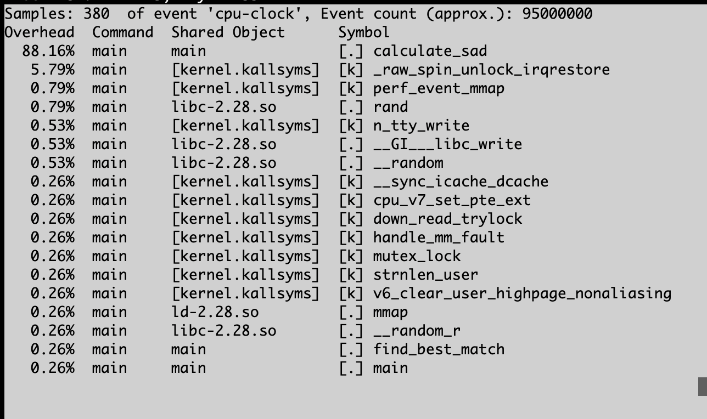
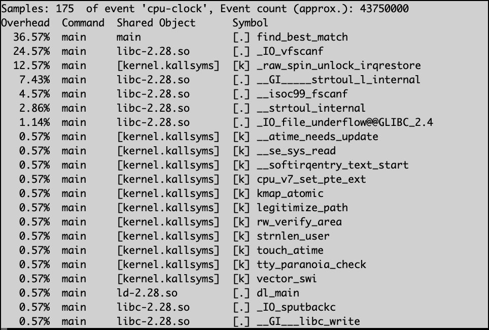
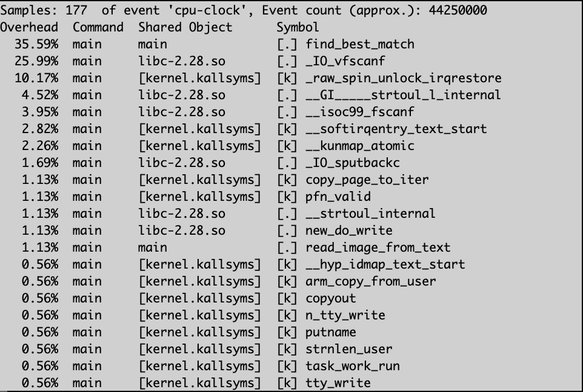
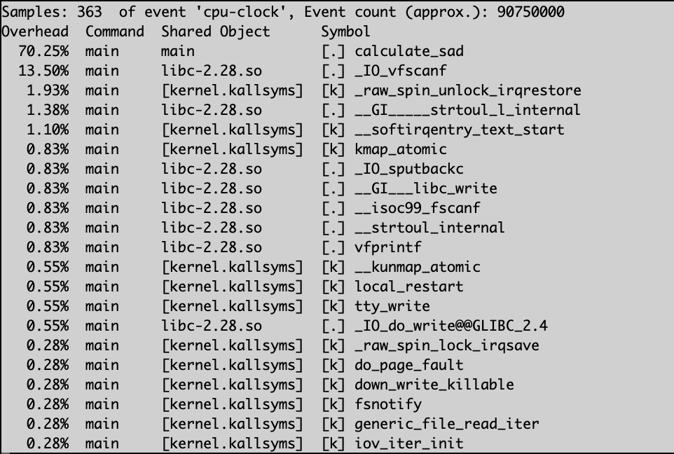
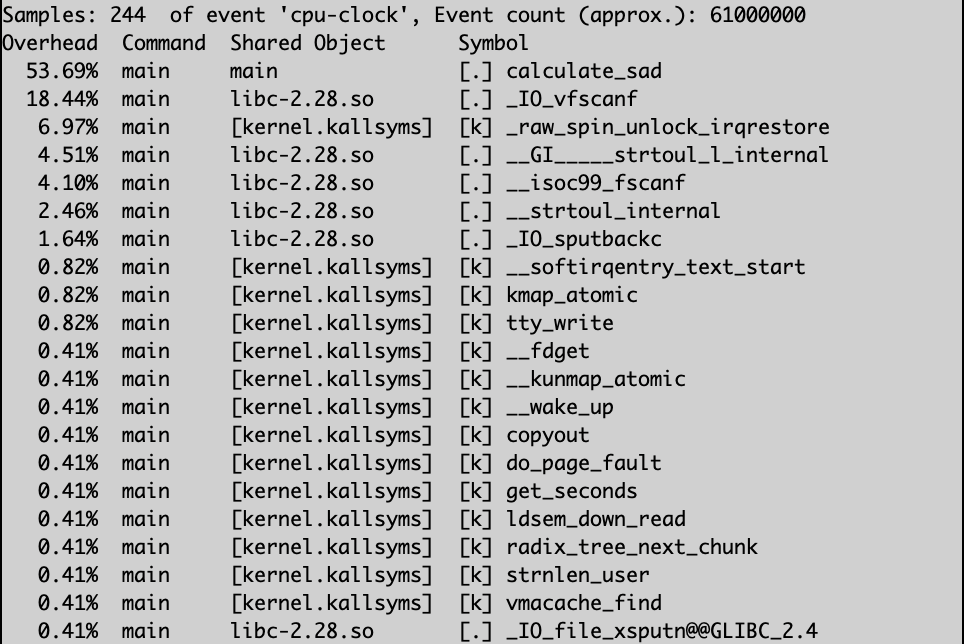
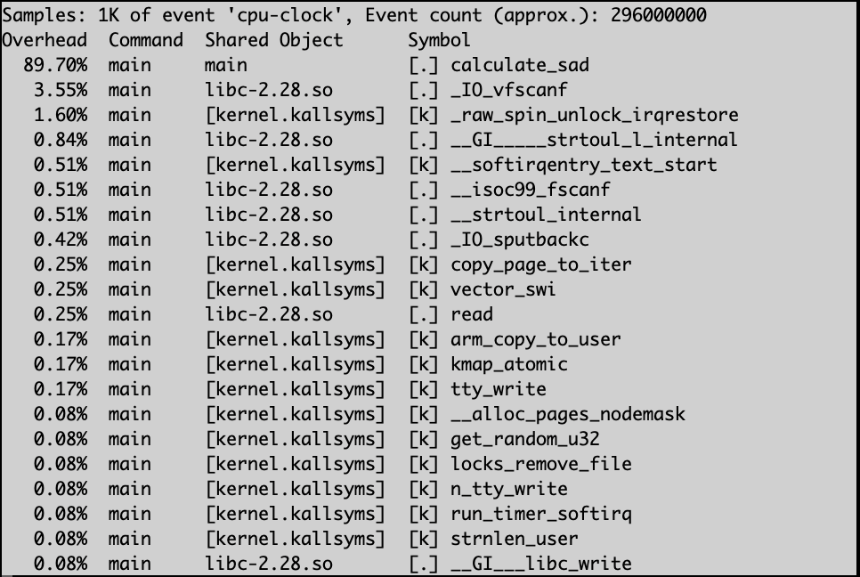
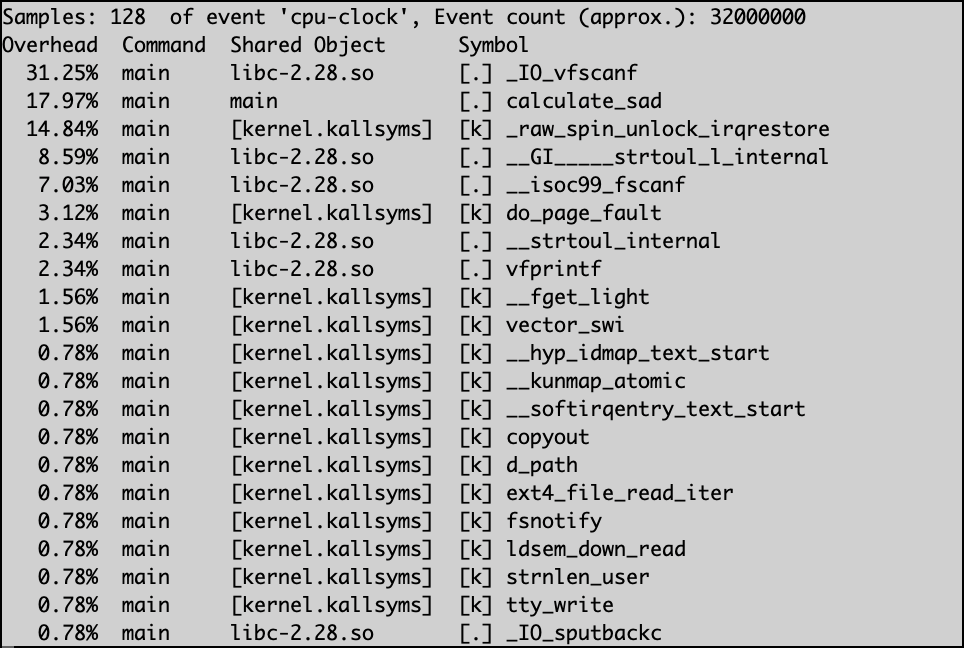

# Motion Estimator System

Configured to run on an ARM 32-bit system, with an 8-bit word depth.

## Commands

### Build

- Build without optimizations: `gcc -O0 -o main main.c`
- Build with O3 level GCC optimizations: `gcc -O3 -o main main.c`
- Build with NEON intrinsics: `gcc -O0 -mfpu=neon -o main main.c`
- Build assembly code: `gcc -O0 -S -o main.s main.c`
- Build revision 4 with both NEON intrinsics and O3: `gcc -O3 -mfpu=neon -o main main.c`

### Run

- `./main`

### Benchmarks

Perf:

1. Compile code with desired gcc command, ex: `gcc -O0 -o main main.c`
2. `perf record ./main`
3. `perf report`

Valgrind:

1. Compile code with gcc debug flag enabled, ex: `gcc -O0 -g -o main main.c`
2. `valgrind --leak-check=full ./main`

Cachegrind:

1. Compile code with gcc debug flag enabled, ex: `gcc -O0 -g -o main main.c`
2. `valgrind --tool=cachegrind ./main`

### Perf Reports

#### 1. Baseline (no code optimization, or gcc optimization)

#### 2. GCC 3rd-level optimization (no source code optimization)

#### 3. GCC Fast-level optimization (no source code optimization)

#### 4. Revision 1 - Loop unrolling (no gcc optimization)

#### 5. Revision 2 - NEON vector intrinsics

#### 6. Revision 3 - Software pipelining

#### 7. Revision 4 - Loop unrolling + NEON intrinsics + O3 level GCC optimization

