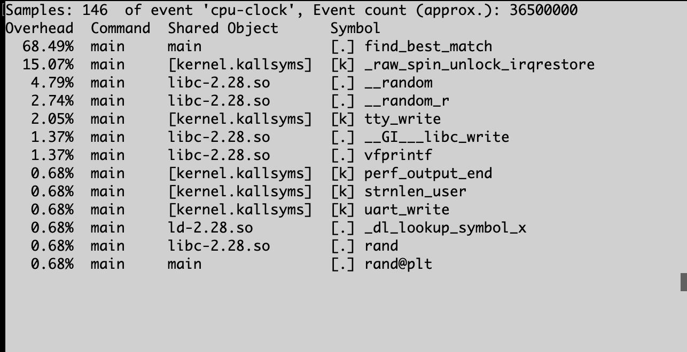
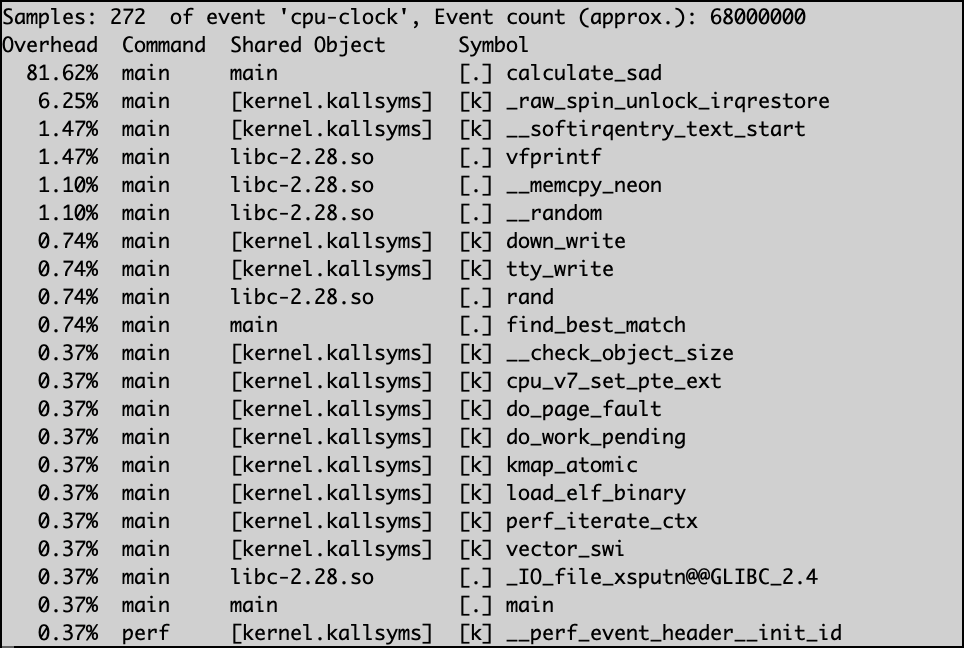

# Motion Estimator System

Configured to run on an ARM 32-bit system.

## Commands

### Build

- Build without optimisations: `gcc -O0 -o main main.c`
- Build assembly code: `gcc -O0 -S -o main.s main.c`

### Run

- `./main`

### Benchmarks

Perf:

1. Compile code with gcc, ex: `gcc -O0 -o main main.c`
2. `perf record ./main`
3. `perf report`

Valgrind:

1. Compile code with gcc debug flag enabled `gcc -O0 -g -o main main.c`
2. `valgrind --leak-check=full ./main`

Cachegrind:

1. Compile code with gcc debug flag enabled `gcc -O0 -g -o main main.c`
2. `valgrind --tool=cachegrind ./main`

### Perf Reports

## 1. Baseline (no code optimization, or gcc optimization)

## 2. GCC optimization (no code optimization)

## 3. Revision 1 - Loop unrolling (no gcc optimization)

