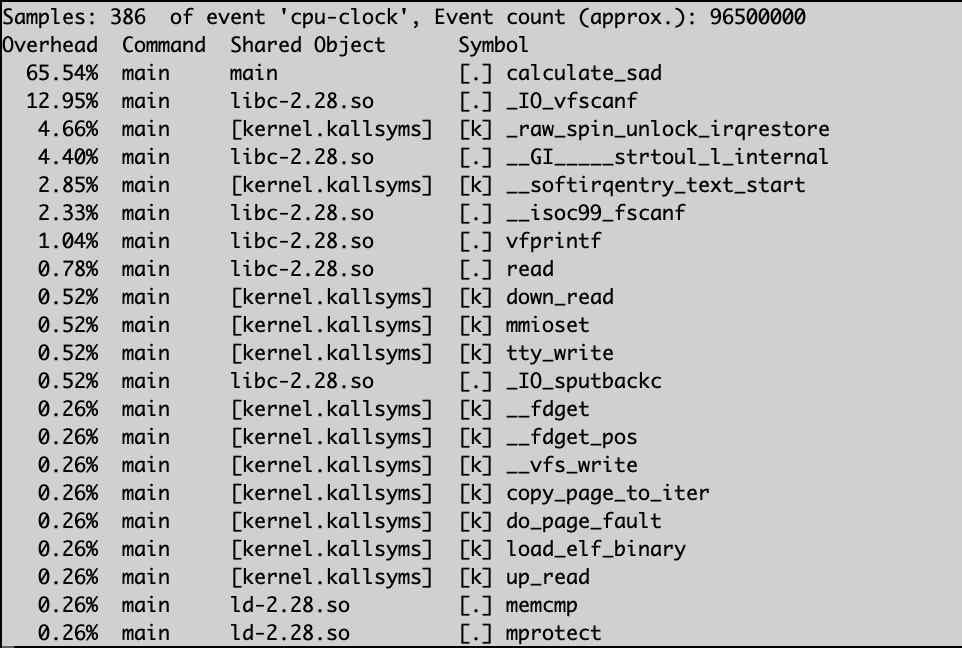

# Motion Estimator System

Configured to run on an ARM 32-bit system, with an 8-bit word depth.

## Commands

### Build

- Build without optimizations: `gcc -O0 -o main main.c`
- Build with O3 level GCC optimizations: `gcc -O3 -o main main.c`
- Build with NEON intrinsics: `gcc -O0 -mfpu=neon -o main main.c`
- Build assembly code: `gcc -O0 -S -o main.s main.c`
- Build revision 4 with both NEON intrinsics and O3: `gcc -O3 -mfpu=neon -o main main.c`

### Run

- `./main`

### Benchmarks

Perf:

1. Compile code with desired gcc command, ex: `gcc -O0 -o main main.c`
2. `perf record ./main`
3. `perf report`

Valgrind:

1. Compile code with gcc debug flag enabled, ex: `gcc -O0 -g -o main main.c`
2. `valgrind --leak-check=full ./main`

Cachegrind:

1. Compile code with gcc debug flag enabled, ex: `gcc -O0 -g -o main main.c`
2. `valgrind --tool=cachegrind ./main`

### Perf Reports

#### 1. Baseline (no code optimization, or gcc optimization)

#### 2. GCC 3rd-level optimization (no source code optimization)

#### 3. GCC Fast-level optimization (no source code optimization)

#### 4. Revision 1 - Loop unrolling (no gcc optimization)

#### 5. Revision 2 - NEON vector intrinsics

#### 6. Revision 3 - Software pipelining

#### 7. Revision 4 - Loop unrolling + NEON intrinsics + O3 level GCC optimization

### Report Conclusion

As a team, we implemented and optimized a motion estimation system using a 16x16 block-based Sum-Of-Absolute-Difference (SAD) algorithm on an ARM Cortex-A57 processor. Through various optimization techniques, including loop unrolling, NEON intrinsics, and software pipelining, significant performance gains were achieved compared to the baseline implementation.

The performance evaluation demonstrated that combining loop unrolling, NEON intrinsics, and GCC ‘-O3’ optimization yielded the most substantial improvements. This approach reduced instruction references by 82% and data references by 85%, achieving the lowest execution time of 0.808 seconds, a 61% improvement over the baseline. The CPU utilization was also minimized to 31.25%, indicating efficient use of the processing resources.

Despite these advancements, the inherent limitation of 32-bit registers remained a bottleneck. For further performance enhancements, transitioning to a 64-bit processor would enable handling larger data sets and blocks of pixels more efficiently, dramatically reducing calculation times for the SAD function.

We recommend that the client adopt the fourth optimization revision, which combines loop unrolling, NEON intrinsics, and GCC ‘-O3’ optimizations, for the best performance within the current system architecture. This approach not only optimizes execution speed but also reduces CPU utilization, potentially allowing for processor downgrades if necessary.

For future improvements, investing in a 64-bit processor is advised to overcome the limitations of a 32-bit system, to achieve even greater performance. Ensuring adequate memory and cache availability will be crucial to fully leveraging the benefits of an architectural upgrade.

